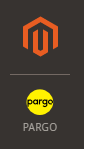
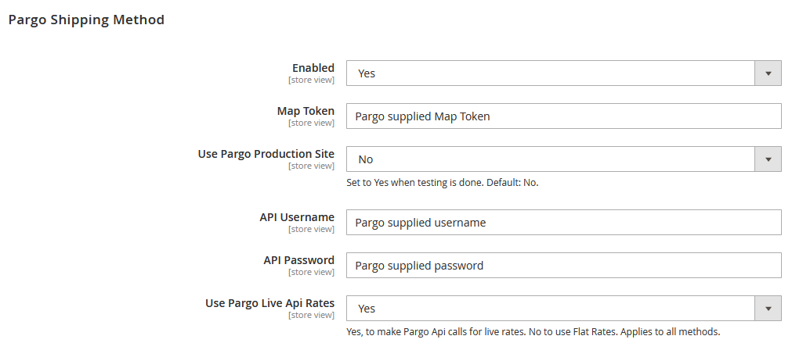
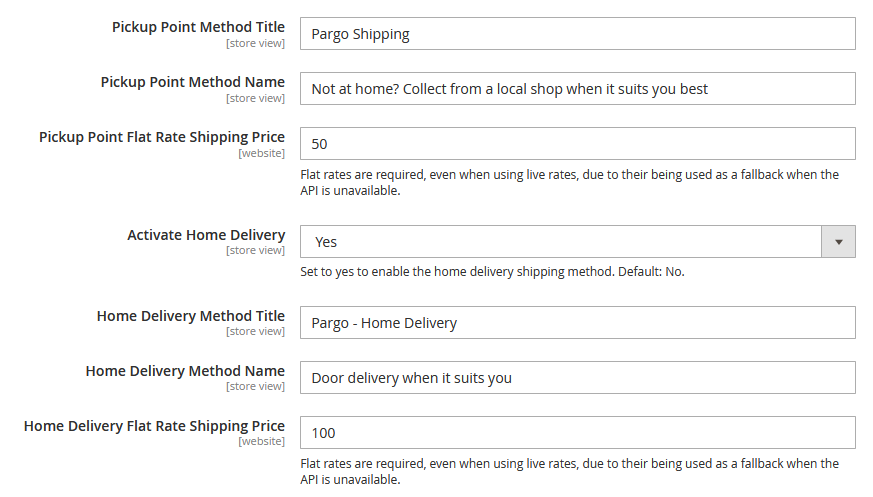
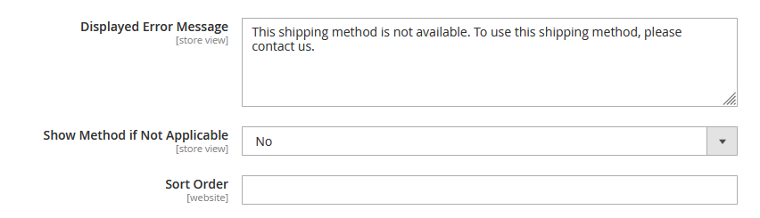

# Pargo Shipping Plugin for Magento
Magento 2 Module Manual

Document Last Update Date: 16-02-2022

# General Information

Before using the Pargo Shipping Method you need to contact Pargo to retrieve your unique map token and authorization code. This allows your customers and yourself to use the Pargo service.

**Pargo contact information:**

[info@pargo.co.za](mailto:info@pargo.co.za)

[https://pargo.co.za](https://pargo.co.za)

021 447 3636

**Installation**

Please make sure you have backups of your system before proceeding as components of this nature can clash with each other.
Make sure you have selected the correct component for the Magento you are running as this is critical to ensuring success.

There are two ways to install the Pargo Shipping extension:

1. Composer installation
2. Manual installation

**Composer installation**

From your magento folder running as the owner of the website (typically the credentials you have been given by your ISP) run the following command:

```ssh
  composer require pargopoints/plugin-magento
```

**Manual Installation**

Download or clone the code from our git repository:

The code needs to be deployed to ``<web root>/app/code/Pargo/CustomShipping``, if these folders do not exist then your need to create them.

**Post Component Install**

Please run the following commands from your webroot after your initial installation to complete the setup.

```
bin/magento setup:upgrade
bin/magento cache:clean
bin/magento cache:flush
bin/magento setup:static-content:deploy --force
```

**Plugin Configuration under Magento Admin**

If you have successfully installed the Pargo plugin you will see our icon once you login to Magento Admin.  



Clicking on the icon will take you to the shipping settings where the Pargo Shipping Method will be visible.



The following steps will get you up and running quickly

**Enabling the Plugin**

Enable the plugin in Magento by selecting Yes from the Enabled drop down.

**Adding the the map token provided by Pargo.**

Enter the Map Token provided by Pargo into the Map Token field if required.

**Live**

Live is by default set to No so you can test, if you are on a production site please set this to Yes.

**Adding the API credentials provided by Pargo.**

Enter the email address you use for your account and the password provided by the Pargo team.

**Choose if you want to use live or static rates**

Selecting to use the live api rates will do an api lookup to get the Home Delivery rates.



**Pickup Point Method Title**

Change the default name of our shipping module to something more suitable for your site.

**Pickup Point Method Name**

Change the default description of our shipping module to something more suitable for your site.

**Pickup Point Flat Rate Shipping Price**

Set the Pickup Point Flat Rate Shipping Price. Live rates are not used for the Pickup Points.

**Activate Home Delivery**

Choose Yes to enable the Home Delivery Method and Display it as a shipping method.

**Home Delivery Method Title**

Change the default name of our shipping module to something more suitable for your site.

**Door to Door Method Name**

Change the default description of our shipping module to something more suitable for your site.

**Setting the flat rate home delivery shipping price**

Set the Home Delivery Flat rate price. This price is used when live rates is switched off, or when the live rate is not returned for some reason.



**Set custom display error message**

You can set a custom display error message specific to the Pargo plugin.
Locate the Displayed Error Message field enter your custom error message, hit the save config button.
This message normally displays if you the address you are shipping to is outside of the country.

**Show Method if Not Applicable**

If set to No, the Pargo Methods will only show if appropriate information has been entered.

**Sort Shipping method position**

You can sort the shipping method position.

Locate the Sort field enter position rank in numeric form, hit the save config button.
To make the Pargo Shipping method rank on the top set the order field to 0 and hit the save config button.

**Thank you for using Pargo!**
