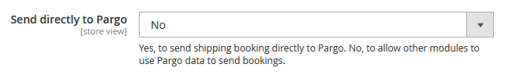

# Pargo Shipping Plugin for Magento
Magento 2 Module Manual

Document Last Update Date: 08-04-2022

Compatibility: 

- Designed for Magento 2.4 
- Tested up to 2.4.3
- Backward compatibility tested up to Magento 2.3.7-p1
- PayPal integration tested

# General Information

Before using the Pargo Shipping Method you need to contact Pargo to create a user account. 

This is needed to get your unique map token and authorization code from Pargo. This allows your customers and yourself to use the Pargo service.

If starting off in staging, request staging authorization credentials from Pargo. When moving over to production, request production credentials from Pargo.

**Pargo contact information:**

[info@pargo.co.za](mailto:info@pargo.co.za)

[https://pargo.co.za](https://pargo.co.za)

021 447 3636

**Installation**

Please make sure you have backups of your system before proceeding as components of this nature can clash with each other.
Make sure you have selected the correct component for the Magento you are running as this is critical to ensuring success.

There are two ways to install the Pargo Shipping extension:

1. Composer installation
2. Manual installation

**Composer installation**

From your magento folder running as the owner of the website (typically the credentials you have been given by your ISP) run the following command:

```ssh
  composer require pargopoints/plugin-magento
```

**Manual Installation**

Download or clone the code from our git repository:

The code needs to be deployed to ``<web root>/app/code/Pargo/CustomShipping``, if these folders do not exist then your need to create them.

**Post Component Install**

Please run the following commands from your webroot after your initial installation to complete the setup.

```
bin/magento setup:upgrade
bin/magento cache:clean
bin/magento cache:flush
bin/magento setup:static-content:deploy --force
```

**Plugin Configuration under Magento Admin**

If you have successfully installed the Pargo plugin you will see our icon once you login to Magento Admin.  


Clicking on the icon will take you to the shipping settings where the Pargo Shipping Method will be visible.


The following steps will get you up and running quickly

**Enabling the Module**

Enable the module in Magento by selecting Yes from the Module Enabled drop down.

**Use Pargo Production Site**

By default this is set to No so you can test in staging, if you are on a production site please set this to Yes.

**Maptoken**

Your business will receive an authentication map token to enable your iFrame to show your pickup points. Enter this map token in the field shown.
If you would like to start in staging, make sure you are using a staging map token. This token can be used for staging testing: ​​QbafKcMXhXHUFruJFbxRFL80BNjAl95EsJt4Xw4qs78X6eMv
When you are ready to move to production, ensure you use a production map token provided by Pargo. This will make the Pickup Point map visible.

**API credentials**

The API username (an email address) and password can be obtained from Pargo.
Make sure you are using staging credentials when testing in staging, and production credentials when you are ready to start shipping on your live site.


**Choose if you want to use live or static rates**

Selecting Yes to use the live api rates will do an api lookup to get the Home Delivery rates that Pargo charges for different regions, for under 5kg weights. This allows you to pass the benefit of region based costing onto your customers. 

When used in conjunction with the Pargo Pickup Point Shipping Method, it can help lower your logistics costs, by encouraging regional Pickup Point Selection at checkout



**Send directly to Pargo**

Set to “Yes” for order collections to be created automatically with Pargo when the customer is invoiced. These will show up on your MyPargo portal for further actioning (including collection readiness confirmation).
Set to “No” to disable automatic order creation if you would like to develop custom triggers. 

The Pargo module can be used to collect data which is then used by a third party module to book the collections and make the deliveries. More information in the Pargo Privacy Policy. If this is not the intention of use the selection needs to be No.


**Pickup Point Method Title**

Use the default name of our Pickup Point shipping module or change it to something more suitable for your site.

**Pickup Point Method Name**

Use the default name of our Pickup Point shipping module or change it to something more suitable for your site.

**Pickup Point Flat Rate Shipping Price**

Set the Pickup Point Flat Rate Shipping Price. Live rates are not used for the Pickup Points. This field cannot be empty.

**Activate Home Delivery**

Choose Yes to enable the Home Delivery Method and Display it as a shipping method.

**Home Delivery Method Title**

Use the default name of our Home Delivery shipping module or change it to something more suitable for your site.

**Door to Door Method Name**

Use the default name of our Home Delivery shipping module or change it to something more suitable for your site.

**Setting the flat rate home delivery shipping price**

Set the Home Delivery Flat rate price. This price is used when live rates is switched off.


**Set custom display error message**

Use the default Displayed Error Message or set to a custom display error message specific to the Pargo plugin.
This message normally displays if the address fields have not all been completed, or for example, the country has not been set to South Africa. It can also appear when dynamic rates are turned on for home delivery, and the API call to retrieve the rate is taking longer than expected. A recommended default message has been set which covers both scenarios.

**Show Method if Not Applicable**

If set to No, the Pargo Methods will only show if appropriate information has been entered. For dynamic rates it is best to set this to Yes.

**Sort Shipping method position**

This field can be left blank.

Save Config
Make sure you save the configs and clear your Magento Cache for configs to reflect. Start shipping.

**Thank you for using Pargo!**

